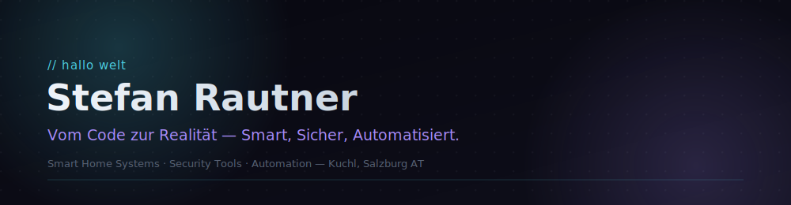

  

 

##  About

I build smart home systems, security tools, and automation — things people actually rely on, not just demos. Currently studying at FH Salzburg, and I handle IT/EDP support for my local volunteer fire department, which is where a lot of my hands-on infrastructure and security work comes from.

`Cyber Security` `Ethical Hacking` `Networking` `Smart Home & Automation` `AI-assisted development`

 

 

##  Projects

<table>
<tr>
<td width="50%" valign="top">

**[Löschwasserförderung](https://github.com/fitforfire/loeschwasserfoerderung.at)**
`Flutter` `Dart` `Open Source`

Cross-platform app that calculates relay line setups for Austrian fire departments. In active use in the field.

</td>
<td width="50%" valign="top">

**NetworkAudit**
`Python` `FastAPI` `Cybersecurity`

Network scanning and security assessment tool — async discovery engine, live topology mapping, encrypted reports.

</td>
</tr>
<tr>
<td width="50%" valign="top">

**Hardware Policy Gateway**
`Python` `Docker` `Embedded`

Default-deny hardware security gateway for Raspberry Pi. Locks down hardware interfaces via isolation and forensic YARA scanning.

</td>
<td width="50%" valign="top">

**NeuroHive**
`Python` `Docker` `Multi-Agent AI`

Local multi-agent system — an AI planner splits goals into tasks, handled autonomously by specialized agents (dev, test, security, docs).

</td>
</tr>
<tr>
<td width="50%" valign="top">

**SparkNet**
`IoT` `AI` `Smart Home`

Cross-platform smart home system: automation, security, voice control, and image recognition in one stack.

</td>
<td width="50%" valign="top">

**Nexus**
`DevOps` `Stripe`

Platform behind Löschzeit & SnackSignal — monitoring, HTTPS, Stripe payments, reverse tunneling.

</td>
</tr>
</table>

→ **[full project list](https://stefanrautner.github.io/#projects)** on the Portfolio

 

 

##  Skills

| | |
|---|---|
| **Languages** | `Java` `Python` `MicroPython` `Bash` — advanced&nbsp;·&nbsp;`C` `C#` `C++` `Dart` `JavaScript` `PHP` `HTML` `CSS` — intermediate |
| **Frameworks** | `Spring Boot` `ASP.NET` (backend) · `Flutter` (cross-platform) · `Bootstrap` `WPF` `JavaFX` (frontend) |
| **Databases** | `MySQL` `SQLite` — advanced&nbsp;·&nbsp;`PostgreSQL` `MongoDB` `MariaDB` — intermediate |

→ **[full skills breakdown](https://stefanrautner.github.io/#skills)** on the Portfolio

 

 

##  Certifications

Cisco — Ethical Hacker, Intro to Cybersecurity · IBM — Cybersecurity Fundamentals, AI Fundamentals

→ **[all certificates](https://stefanrautner.github.io/#certificates)** on the Portfolio

 

 

##  GitHub Stats

 

 

**Let's talk** — open to freelance work and collaboration.

Kuchl, Salzburg, Austria

